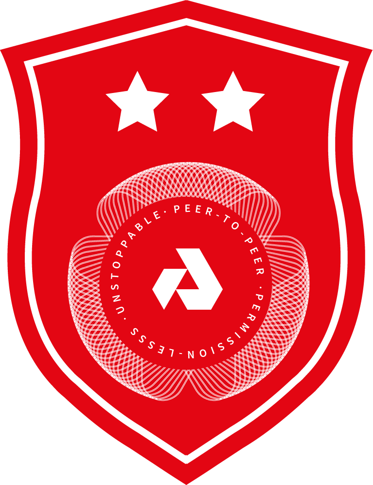

# Akash Ecosystem Rewards

As the world’s first supercloud for serverless computing, Akash needs your support to materialize our vision of empowering the architects and builders of the internet with greater access, freedom, and efficiency to create products that improve the human experience.

In these early days, we want you to join and help us establish the foundation for a valuable and engaged community. In this effort, we’re excited to announce the Akash Founding Member Rewards Program!

Of the 100,000,000 tokens that will ever be pre-mined at genesis, we’re allocating 2% (2,000,000 AKT’s!) to a reward program for early contributors in our community.  Our reward program is inspired by projects from the community, such as Solana’s [Tour de Sol](https://solana.com/tds/), Cosmos [Game of Stakes](https://github.com/cosmos/game-of-stakes), and Kava [Founder Rewards](https://github.com/Kava-Labs/kava/blob/master/docs/REWARDS.md).

## Akash Founding Member Rewards Program

Our Founding Member Rewards Program focuses on Akash Testnet participation.  The program is limited to only 100 members and involves 3 challenges.  Each challenge has a corresponding reward, for a total of **3,500** AKTs:

| Level | Reward | Begins | Challenge |
| --- | --- | --- | -- |
|    **Level 1** | 500 AKT | Nov 6, 2019 | Deploy an end-to-end encrypted chat client on Akash. [Details](founders/level1/README.md).|
|    **Level 2** | 1000 AKT | Nov 12, 2019 | Deploy a secure, decentralized, real-time messaging service on Akash. [Details](founders/level2/README.md).|
|    **Level 3** | 2000 AKT |  Nov 21, 2019 | Sell your spare capacity on Akash. [Details](founders/level3/README.md).|

### Top Price for Top 10 Contributors

We recognize that there are other ways of contributing to Akash’s community, such as helping others navigate through the challenges, or sharing technical guides.  

The top 10 contributing community members will receive the prototype edition of plug-an-earn Akash Supermini aka slick portable server for your home will be mailed to you!

Simply plug it in, become a node for Akash, and earn your favorite currency from offering compute to Akash’s marketplace!

### Important Dates

- **Friday, December 13th, 2019 at 5PM PST**: Deadline to complete our three challenges by 5 PM PST.
- **Tuesday, December 17th, 2019**: Winners Announced!
