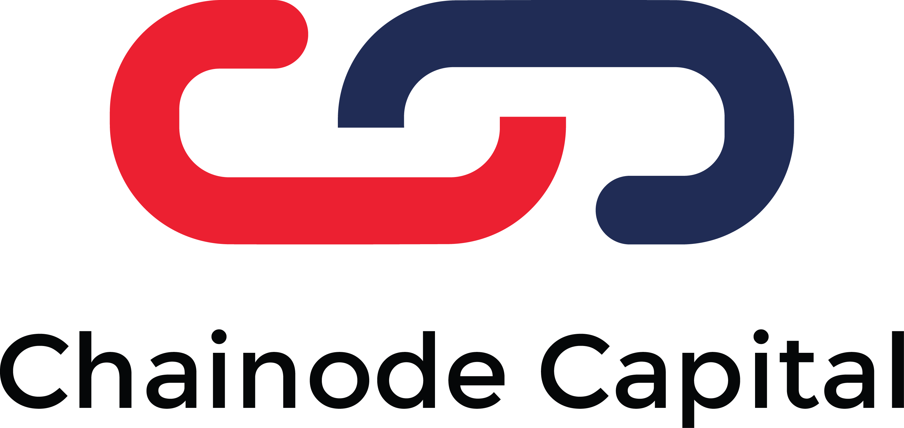
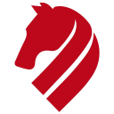
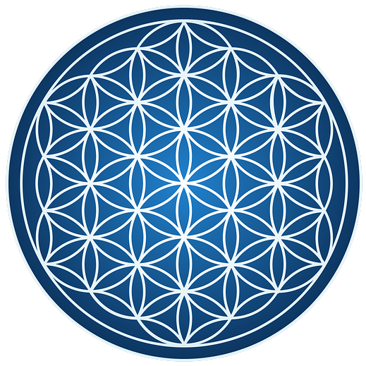
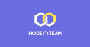
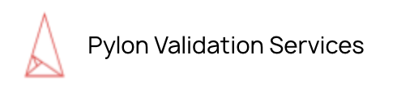
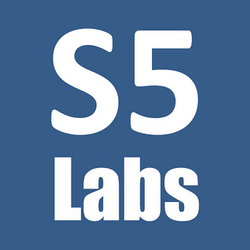
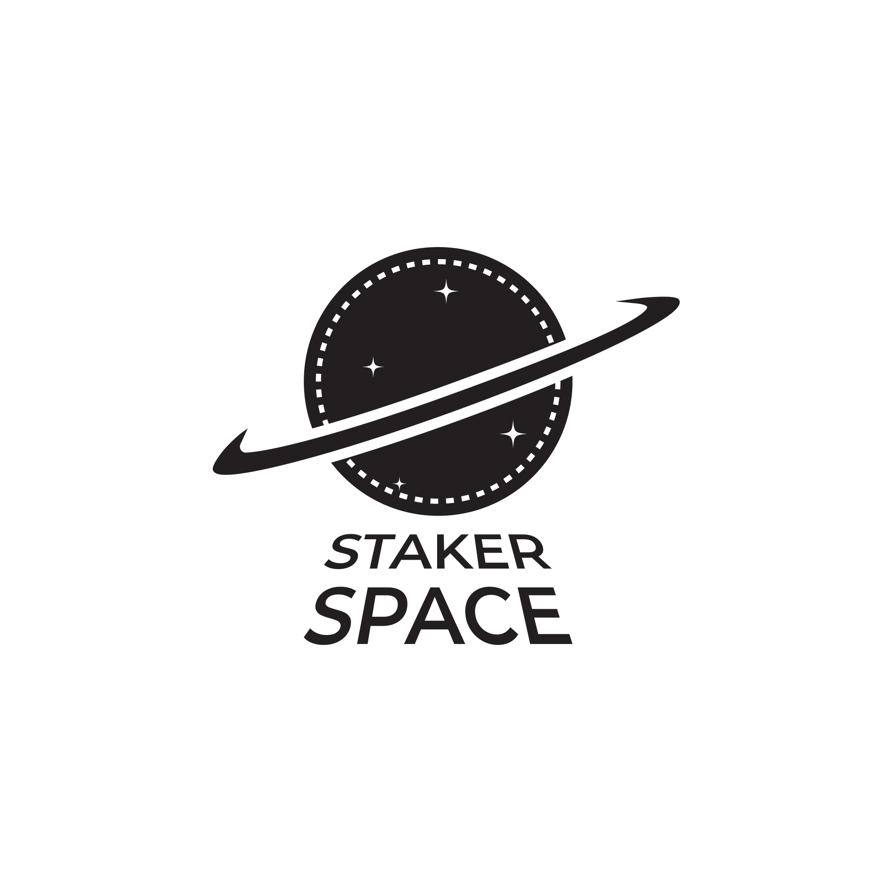
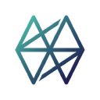
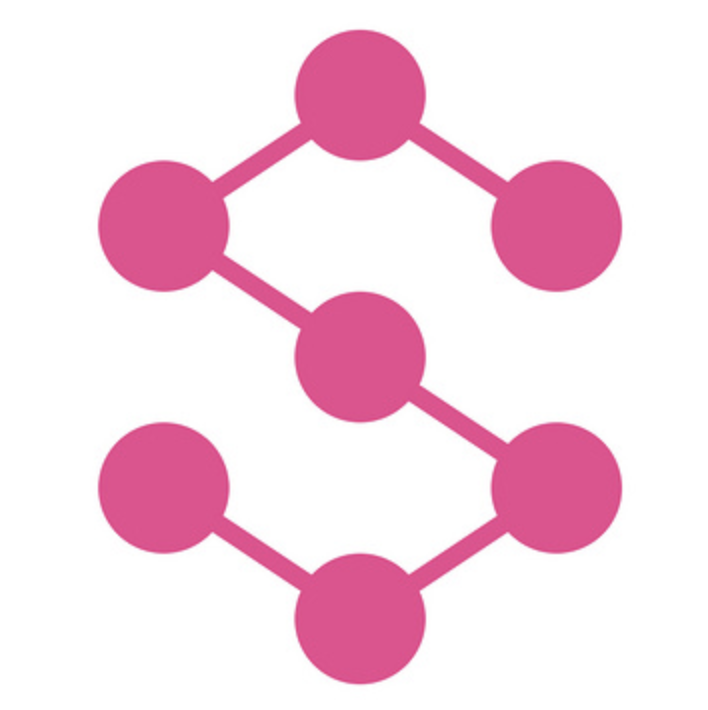

## Founder Level 1 Status

### Submissions

**Total**: 31 / 100

### Validators

<table><tr><td width='200px' style='text-align:center; width:200px'>   Kysen Pool</td> <td width='200px' style='text-align:center; width:200px'>   Vitwit</td> <td width='200px' style='text-align:center; width:200px'>   Bitcat</td> <td width='200px' style='text-align:center; width:200px'>   Chainode Capital</td></tr>
<tr><td width='200px' style='text-align:center; width:200px'>   Forbole</td> <td width='200px' style='text-align:center; width:200px'>   KalpaTech</td> <td width='200px' style='text-align:center; width:200px'>   OpenFaas</td> <td width='200px' style='text-align:center; width:200px'>   Nodeasy.com</td></tr>
<tr><td width='200px' style='text-align:center; width:200px'>   Node A-Team</td> <td width='200px' style='text-align:center; width:200px'>   Pylon Validation Service</td> <td width='200px' style='text-align:center; width:200px'>   Stake5 Labs</td> <td width='200px' style='text-align:center; width:200px'>   Staker Space</td></tr>
<tr><td width='200px' style='text-align:center; width:200px'>   Ubik Capital</td> <td width='200px' style='text-align:center; width:200px'>   Westaking</td> <td width='200px' style='text-align:center; width:200px'>   Stake.host</td> <td width='200px' style='text-align:center; width:200px'>   chainvibes.com</td></tr></table>
