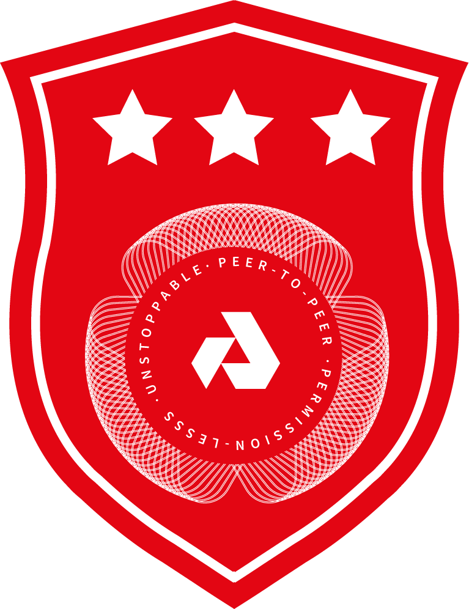

<p align="center">

</p>

**Challenge**: Become a Akash Provider

**Reward**: 2000 AKT

**Bonus Reward**: 2000 AKT

**Instructions**:

1. Sign up for an Akash Account [Testnet](https://akash.network/testnet).
2. Follow the [Instructions](https://docs.akash.network/providers/kube) to become a Akash Provider.

**Submission**:

1. Fork the [ecosystem repository](https://github.com/ovrclk/ecosystem).
2. Clone the ecosystem repository to your workstation. For example, where `<user>` is your GitHub username:

```shell
git clone https://github.com/<user>/ecosystem.git
```

3. Create a file a file at `founders/level3/${MACHINE_ZONE}.yaml` with the below contents:

- Your participation id from [Akash Rewards](https://akash.network/rewards).
- The address of the provider.

For example:

```
echo 'participation: 3bif3qp17x22l' > founders/level3/akash.yourdomain.com
echo 'provider: 7e99e953d23570c2350ae6eee6937d00b6accc258f1904c4547b7aabd900b1dd' >> founders/level3/akash.yourdomain.com
```

Where `3bif3qp17x22l` is the participation id and `akash.yourdomain.com` is your domain. See submissions for examples.

4. Commit your code, and send a pull request to [ecosystem repo](https://github.com/ovrclk/ecosystem).

**Bonus Reward**: 2000 AKT

| Reward | Condition |
| --- | --- |
| 150 AKT | Complete 10 Leases. |
| 350 AKT | Complete 50 Leases. |
| 500 AKT |  Offer compute for 15 consecutive days. |
| 1000 AKT | Offer compute for 30 straight days. |

